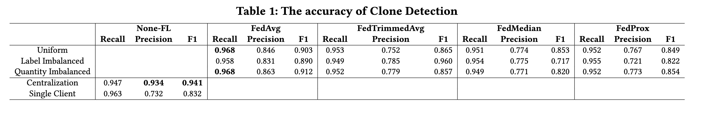
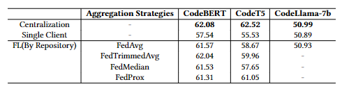
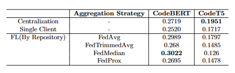
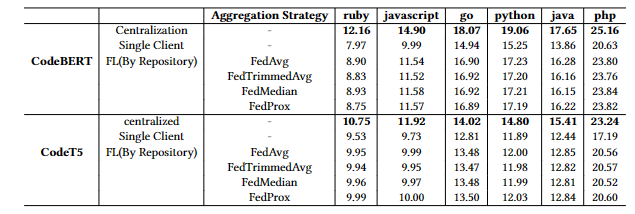
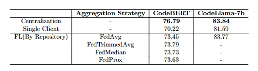

# Open-Source AI Models: Exploring the Potential and Challenges of Collaborative Software Learning

## Framework
Our project utilizes [Flower](https://flower.ai/) as the core Federated Learning Framework. In `client.py`, the `NUM_CLIENTS` can be adjusted according to your needs. Additionally, you have the flexibility to opt for different aggregation strategies to tailor the learning process.

## Datasets
We leverage datasets from [CodeXGLUE](https://github.com/microsoft/CodeXGLUE). Specifically, we focus on five tasks: Clone-detection, Defect-Detection, Code-to-Text, NL-code-search-Adv, and CodeCompletion-token. These tasks offer a comprehensive assessment of model performance in real-world programming contexts, demonstrating their prowess in code understanding, generation, and manipulation.

Before employing Federated Learning, ensure the datasets are appropriately partitioned.

## Models
Our experiments incorporate four distinct models: [CodeBERT](https://huggingface.co/microsoft/codebert-base), [CodeT5](https://huggingface.co/Salesforce/codet5-base), [CodeGPT](https://huggingface.co/microsoft/CodeGPT-small-java), and [CodeLlama-7b-hf](https://huggingface.co/codellama/CodeLlama-7b-hf).


## Quick Start
To set up the environment, follow these steps:
```bash
conda create --name FL python=3.10
conda activate FL
pip install -r requirements.txt
```

## Code Structure
Each task has three primary directories: code, dataset, and evaluator. The code directory includes cc_func.py which contains functions for training and evaluation, while client.py serves as the Federated Learning entry point.

For fine-tuning Large Language Models (LLMs), we employ 2 Nvidia A100 GPUs. Due to the substantial memory requirements of federated fine-tuning for LLMs, we avoid using Flower's start_simulation function. Instead, we separately initiate the server and client in Flower for federated learning processes.
## Result of our work
### Clone-Detection

### Defect-Detection

### Code-Search

### Code-to-Text

### Code-Completion

## Additional Information
We provide a ready-to-use framework for model training with Federated Learning. Configuration adjustments can be made in /Federated_Learning to suit your specific requirements.